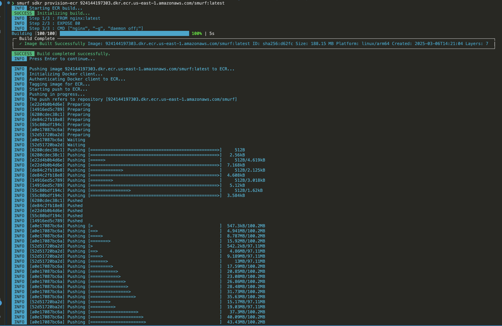
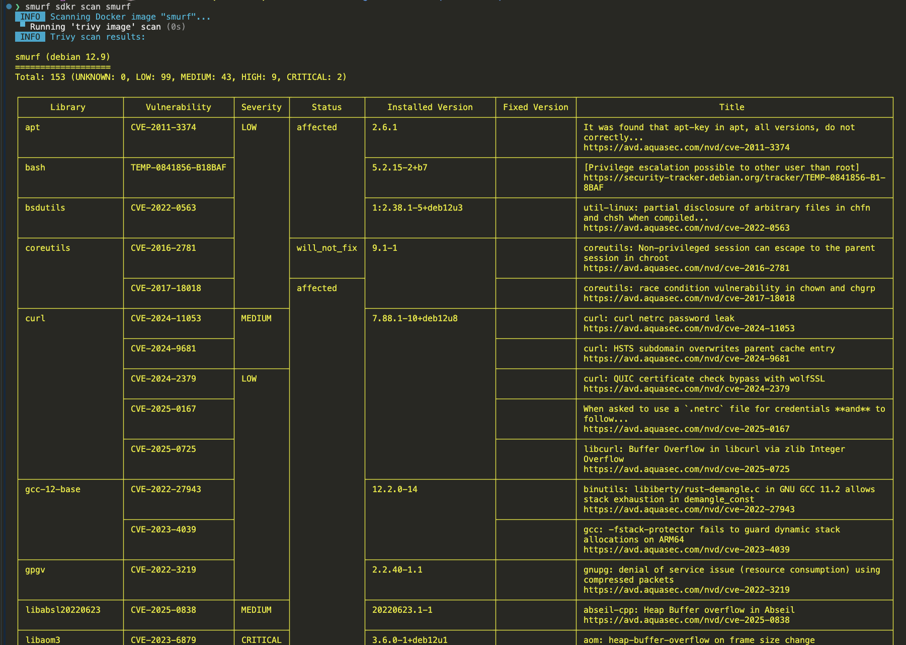
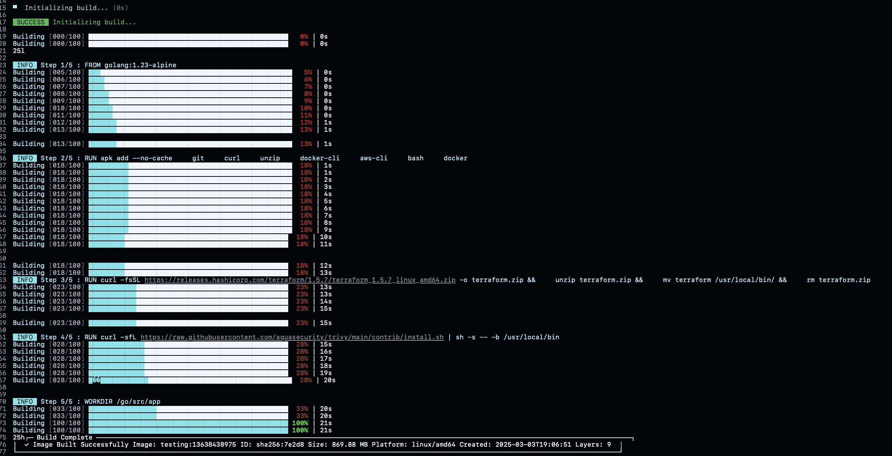
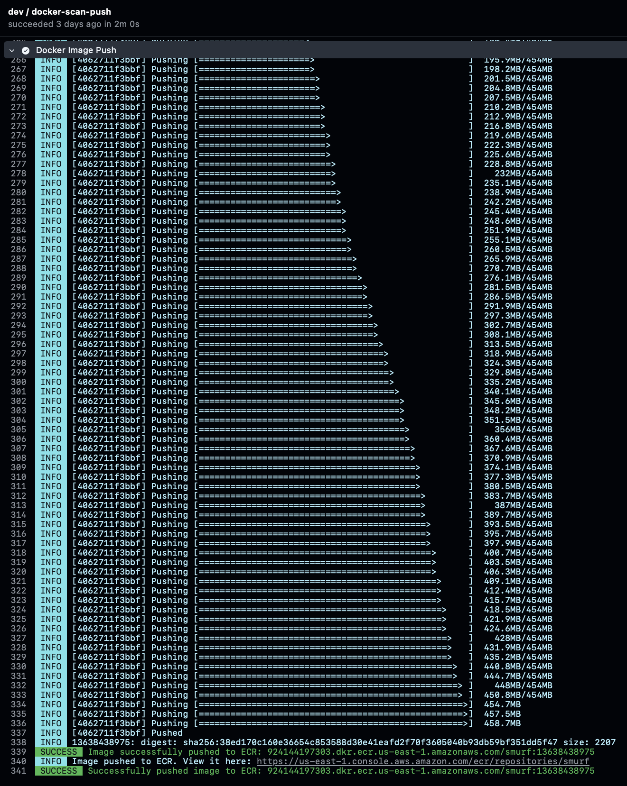

# Docker User Guide 🐳

Use `smurf sdkr <command>` to run smurf sdkr commands. Supported commands include:

- **build:** Builds a Docker image with the specified name and tag.
- **provision-acr:** Builds and pushes a Docker image to Azure Container Registry (ACR).
- **provision-ec:** Builds and pushes a Docker image to AWS Elastic Container Registry (ECR).
- **provision-gcr:** Builds and pushes a Docker image to Google Container Registry (GCR).
- **provision-hub:** Builds, scans, and pushes a Docker image to Docker Hub for enhanced security.
- **push:** Pushes Docker images to ACR, ECR, GCR, or Docker Hub in one simple command.
- **remove:** Deletes a Docker image from your local system to free up space.
- **scan:** Analyzes a Docker image for known security vulnerabilities before deployment.
- **tag:** Tags a Docker image for easy identification and repository management.

## Using Smurf Docker in local environment
Suppose you want to build and push a docker image to AWS Elastic Container Registry (ECR).To do this run the command: 
```bash
smurf sdkr <ecr_url>
```


Suppose you want to scan a docker image named smurf using smurf. 
To do this run the command: smurf sdkr scan <img_name>

```bash
smurf sdkr scan <img_name>
```


## Using Smurf Docker in GitHub Actions
Using Smurf Docker in GitHub Actions involves calling the Smurf shared workflow.
To Build and Push Image to AWS ECR workflow will look like-
```yaml
jobs:
 dev:
   uses: clouddrove/github-shared-workflows/.github/workflows/smurf.yml@master
   with:
     aws_auth: true
     docker_enable: true
     docker_build_command: build <img_name>:<img_tag>
     docker_push_command: push aws <ecr_url>:<img_tag>
     aws-role: <aws_role>
     aws-region: <aws_region>
     aws_auth_method: oidc
```


